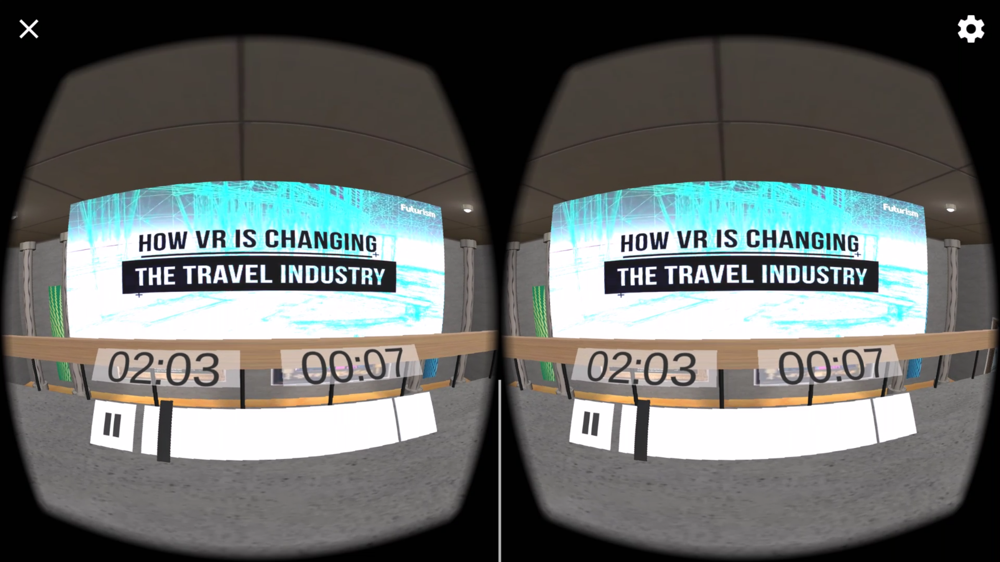
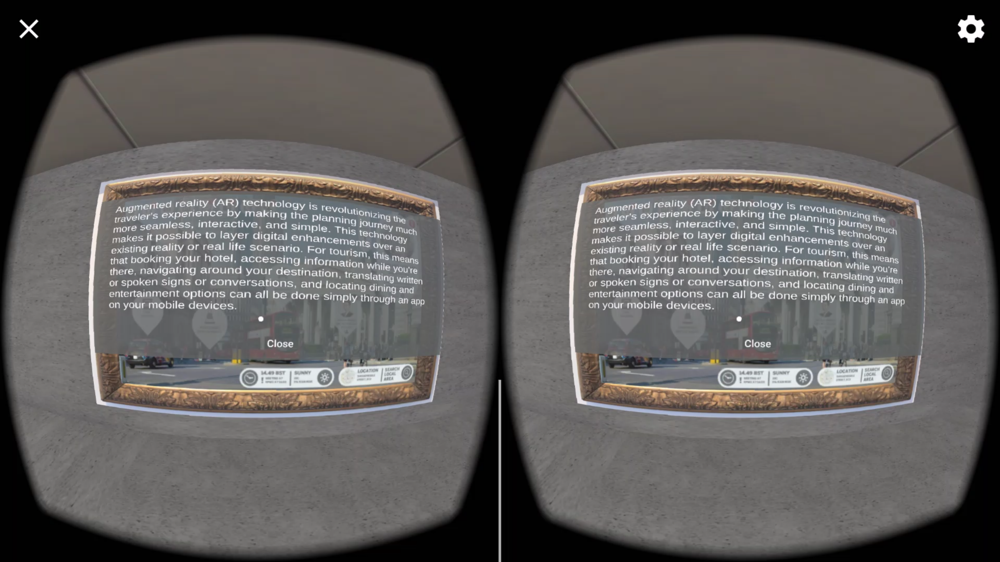

# Night at the Museum
This project is part of the Udacity VR Nanodegree program, and is a bit more complex then my previous projects. After researching how VR is changing the travel industry, I was tasked with creating an interactive scene that helps to educate users on what I learned. I chose to create a museum with interactive paintings that display text pop-ups when you click on them. I did my best to create a scene that looks and feels like an actual museum, and tried to use lighting and some visual cues to highlight which exhibits are interactive. You navigate through the museum by clicking on waypoints, which are represented by spinning red gems. There is also a second floor with several additional exhibits and a big window looking outside. I also created a spinning 3D camera object as a bonus exhibit for fun.

## Installation
* If you own an Android phone, you can install the app by simply copying the `NightAtTheMuseum.apk` file from the **Build** directory onto your android device, and installing the apk by clicking on it from the file manager.
* If you own an iPhone, you will need to follow the instructions below for **contributing** to this app, and then switch to the iOS platform in build settings before rebuilding and running on your phone.

## Contributing
You will need to download and install the [Unity Game Engine](https://unity3d.com/), as well as the [Google VR SDK Plugin for Unity](https://developers.google.com/vr/unity/download) to be able to edit this app.  Next, you will need to clone this GitHub repo, and then open `Night at the Museum` in the Unity editor to begin making modifications to the project.

## Lessons Learned
I learned a lot about importing textures and pictures from the web while working on this project, as well as creating my own objects from some of the simple 3D shapes you can create in Unity.  Building this museum from scratch also helped to enforce many of the building techniques and princicples we learned in previous lessons, and I found myself going back to some of the previous course material several different times to recall what we had learned. I even updated to all the latest versions of unity and the googlevr SDK. I had a blast creating this application

Unity Version: 2017.1.1f1
GoogleVR: 1.70.0
